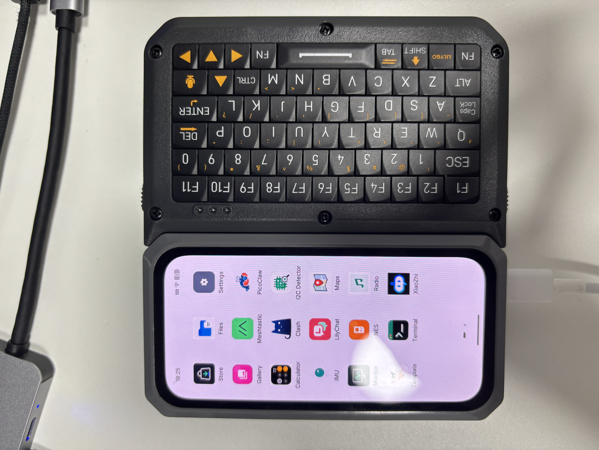

# LILYGO UI

LILYGO UI is an open software platform for LILYGO devices, providing a consistent user interface and a growing collection of applications for everyday use, system management, and hardware interaction.

## Supported devices

| T-DisplayCM0         | T-DisplayK230(暂未支持) |
| :------------------: | :--------------------: |
|                      |  |

## Developer Tools & References

- [template](https://github.com/LILYGO-UI/template): A starter template for LILYGO UI applications.
- [lpm](https://github.com/LILYGO-UI/lpm): The standard project management CLI for LILYGO UI.
- [packages](https://github.com/LILYGO-UI/packages): The reviewed source of truth for the LILYGO UI application registry.

## Official Apps

| App | Description |
| --- | --- |
| [Calculator](https://github.com/LILYGO-UI/calculator) | A touch-friendly scientific calculator |
| [Files](https://github.com/LILYGO-UI/files) | File manager |
| [Gallery](https://github.com/LILYGO-UI/gallery) | Standalone photo browser |
| [I2C Detector](https://github.com/LILYGO-UI/i2c-detector) | Scan Linux I2C buses and inspect detected 7-bit addresses |
| [IMU](https://github.com/LILYGO-UI/imu) | Six-axis motion viewer |
| [Launcher](https://github.com/LILYGO-UI/launcher) | Application launcher |
| [Maps](https://github.com/LILYGO-UI/maps) | Online map viewer |
| [Monitor](https://github.com/LILYGO-UI/monitor) | Lightweight system dashboard |
| [Radio](https://github.com/LILYGO-UI/radio) | Discover and play stations from Radio Browser |
| [Sensors](https://github.com/LILYGO-UI/sensors) | Native sensor and input diagnostic tool |
| [Settings](https://github.com/LILYGO-UI/settings) | System settings |
| [Store](https://github.com/LILYGO-UI/store) | Application store |
| [Terminal](https://github.com/LILYGO-UI/terminal) | Interactive shell for LILYGO devices |
| [XiaoZhi](https://github.com/LILYGO-UI/xiaozhi) | XiaoZhi assistant with expressions, live captions, and voice chat |
| [YouTube](https://github.com/LILYGO-UI/youtube) | Search and watch YouTube on LILYGO devices |
